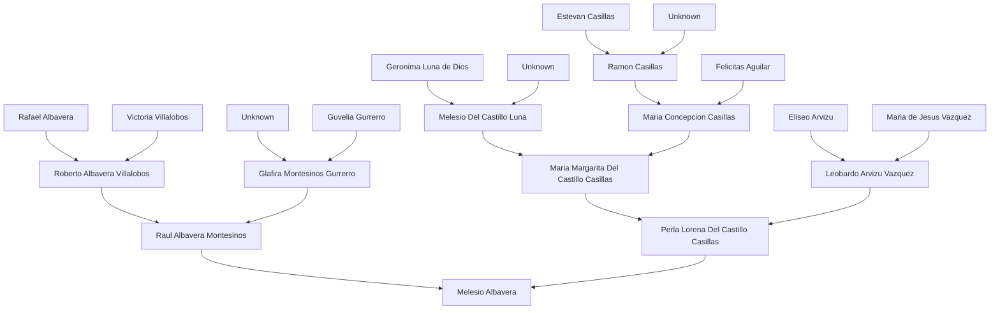

## 09-11-2022
---
### Daily Metrics
---
### Tasks:
- [x] Shower.
- [ ] Laundry (Include bedding.)
- [ ] Food Preparation.
- [x] Vacuum Desk Area.
- [ ] Essay.
- [ ] Take Physics Notes for the Week.
- [ ] Start History Assignment 3.
- [ ] Create laptop backup image.
- [ ] Move to **0 - Inbox**.
- [ ] Atomize notes.
- [ ] Move back to **1 - Daily Notes**.
---
### Ideas:
- I should attend more of the Physics Learning Center Sections.
- Develop Obsidian Plugin for Digital Logic.
---
### Notes:
- Genealogy:

---