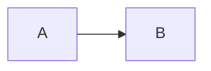
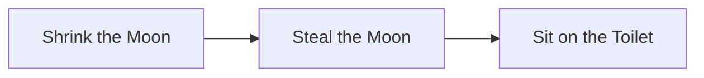
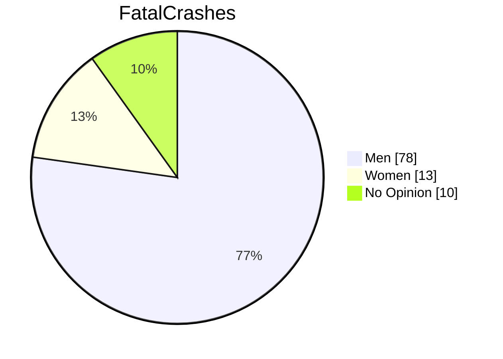

# Mermaid
---
***Mermaid.js*** has a similar [syntax](https://mermaid-js.github.io/mermaid/#/README?id=diagram-types) to Markdown.

## Basic Syntax
```js
graph LR;
	A-->B;
```


- Place code between <code>\`\`\`mermaid</code><code>...</code><code>\`\`\`</code>. Specify the graph using a keyword such as `graph` (flowchart) or `pie` (pie chart).

**Flowchart:**
```js
graph LR
	A[Shrink the Moon]
	B[Steal the Moon]
	C[Sit on the Toilet]
	A-->B-->C
```

- 

**Pie Chart:**
```js
pie showData
	title FatalCrashes
	"Men": 78
	"Women": 13
	"No Opinion": 10
```

- 